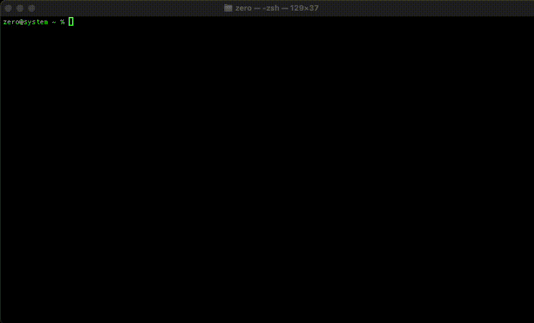

# ibex

<h1 align="center">
  
  <br>
  ibex

  iOS Backup Extraction Tool
  <br>
</h1>

<p align="center">
  <a href="https://golang.org">
    
  </a>
  <a href="./LICENSE">
    
  </a>
  <a href="https://github.com/initz3r0/ibex/releases/latest">
    
  </a>
</p>

`ibex` is a cross-platform tool designed for decrypting and extracting iOS backups. It provides forensic investigators, security researchers, and power users with the ability to access and analyze encrypted iOS backup data. It can be built and used on macOS, Linux, and Windows **and is permitted to be used only with the explicit and informed consent of the backup data owner**.

`ibex` was built for the researchers and defenders aiding civil society victims of spyware and stalkerware.


## Features

- 🔐 Decrypt encrypted iOS backups
- 📱 Support for latest iOS versions
- 💻 Cross-platform compatibility (macOS, Windows, Linux)
- 🚀 Automatic backup detection
- 🎯 Single file extraction based on filename match
- 📂 Structured output organization
- 🔍 Detailed manifest parsing and extraction

## Installation

### From Source

```bash
git clone https://github.com/initz3r0/ibex.git && cd ibex

go build

./ibex
```

### Homebrew 

```
brew install initz3r0/tap/ibex
```

### From Binary

Download the latest release for your platform from the [releases page](https://github.com/initz3r0/ibex/releases).

## Usage

### Basic Usage Examples

```bash
# Run with automatic backup detection and interactive mode
ibex

# Specify just the backup path
ibex -b /path/to/backup

# Specify backup path and password
ibex -b /path/to/backup -p "backup_password"

# Specify custom output directory
ibex -b /path/to/backup -p "backup_password" -o /path/to/output

# Specify a single file for decryption and extraction
ibex -b /path/to/backup -o /path/to/output --file sms.db

# Specify relative path preserved ouput
ibex -b /path/to/backup -o /path/to/output -r
```

### Command Line Options

Simply running `ibex` will launch the program in interactive mode and will guide you through the decryption process. The tool also supports a number of optional flags depending on your needs.

```
Flags:
  -b, --backup string     (optional) iOS backup path
  -f, --file string       (optional) Name or substring of a single file to extract and decrypt
  -o, --output string     (optional) Output directory path
  -p, --password string   (optional) Backup decryption password
  -r, --relative          (optional) Output decrypted files using the original file structure
```

## How It Works

`ibex` performs the following steps to decrypt and extract iOS backups:

1. Reads and parses the Manifest.plist file
2. Builds and unlocks the Keybag using the provided password
3. Unwraps the Manifest DB Key and decrypts Manifest.db
4. Processes each file in the backup, decrypting contents as needed

## Output Structure

`ibex` creates an organized output directory with the following (default) structure:

```
~/ibex/
├── [Device_UDID]
│   ├── [Device_Name]_[Last_Backup_Date]
│   │   ├── Decrypted_Manifest.db
│   │   ├── [FileID]--[Filename]
│   │   ├── ...
│   │   └── skipped.txt
```

Passing the `-r` flag, `ibex` will output decrypted files using the relative path file structure observed in the backup Manifest.db:

```
~/ibex/
├── [Device_UDID]
    ├── [Device_Name]_[Last_Backup_Date]
    ├── AppDomain-com.apple.Maps
    │   └── Library
    │       ├── Maps
    │       │   └── GeoCollections.plist
    │       └── Preferences
    │           └── com.apple.Maps.plist
    ├── AppDomain-com.apple.Music
    │   └── Library
    │       ├── Preferences
    │       │   └── com.apple.Music.ScriptingLocalStorage.plist
```

## Demo



## Backup an iOS device

See instructions on how to create a local encrypted backup for an iOS device [HERE](docs/backups.md).

## Security Considerations

- Ensure you have proper authorization to access and decrypt the backup
- Always work with copies of backup data, never original backups
- Store and **clean up** extracted data securely
- (macOS) Enable [Secure Keyboard Entry](https://support.apple.com/guide/terminal/use-secure-keyboard-entry-trml109/mac) on your Terminal

## Contributing 

While I welcome and will review Pull Requests, I am currently developing this project independently to maintain a consistent vision and establish a solid foundation. Bug reports, feature suggestions, and feedback are still highly valuable and will influence the project's direction. This solo development approach is temporary, and I plan to open up more collaborative opportunities as the project matures in the near future. 

## Donate

If you find this project valuable and would like to support its mission, instead please consider making a donation to the good folks over at the [Electronic Frontier Foundation (EFF.org)](https://supporters.eff.org/donate) and [Signal Foundation (Signal.org)](https://signal.org/donate/), both of which work tirelessly to enable and defend digital privacy and free speech.


## Questions

If you have general questions or are in need of tooling support, please reach out on Github or Bsky [@initz3r0.bsky.social](https://bsky.app/profile/initz3r0.bsky.social).

If you believe you are a victim of spyware and/or stalkware, please seek assistance or guidance by reviewing the resources below:

- https://www.accessnow.org/help/
- https://stopstalkerware.org/information-for-survivors/

## License

This project is licensed under the MIT License - see the [LICENSE](LICENSE) file for details.


